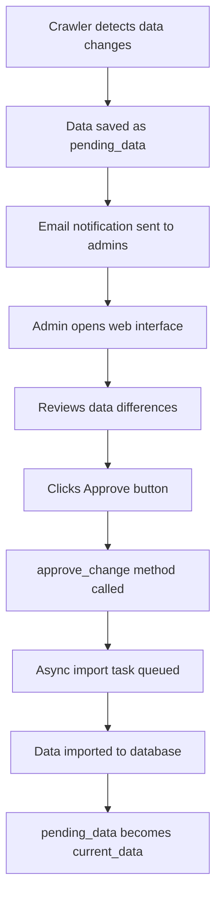

# Spider Module Documentation

The Spider module is responsible for crawling, processing, and importing course data from multiple sources into the CourseReview system.

## Architecture Overview

```
apps/spider/
├── manager.py           # Unified crawler management (CrawlerManager)
├── models.py            # Data models and state management
├── tasks.py             # Asynchronous task definitions
├── views.py             # Admin interface views
├── utils.py             # Common utility functions
├── crawlers/            # Crawler implementations
│   ├── orc.py          # Main crawler system (3 spider classes and 1 intergation class)
│   ├── medians.py      # Grade medians crawler (deprecated)
│   ├── timetable.py    # Course timetable crawler (deprecated)
│   └── data_cache/     # Data cache directory
├── templates/          # HTML templates for admin interface
└── migrations/         # Database migration files
```

## Core Components

### 1. CrawlerManager (manager.py)

The central coordination hub for all crawling operations.

**Key Methods:**
- `crawl_coursesel_data()` - Crawls course selection API data
- `crawl_official_data()` - Crawls official website data
- `integrate_and_import_data()` - Integrates cached data and imports to database
- `_load_cached_data()` - Loads data from cache files

**Usage:**
```python
from apps.spider.manager import CrawlerManager

manager = CrawlerManager()
manager.crawl_coursesel_data()
manager.crawl_official_data()
manager.integrate_and_import_data()
```

### 2. Three-Class Crawler System (crawlers/orc.py)

Modern modular architecture with specialized crawler classes:

#### CourseSelAPICrawler
- Crawls course selection system APIs
- Handles lesson tasks, course catalog, and prerequisites
- Outputs: `lesson_tasks.json`, `course_catalog.jsonl`, `prerequisites.jsonl`

#### OfficialWebsiteCrawler
- Crawls official JI website course pages
- Extracts course descriptions, topics, and instructor information
- Outputs: `official.jsonl`

#### CourseDataIntegrator
- Integrates data from multiple sources with priority system
- Merges course information intelligently
- Handles instructor extraction with fallback priorities:
  1. Lesson tasks data (most current)
  2. Course catalog data 
  3. Official website data (fallback)

### 3. Data Models (models.py)

#### CrawledData Model
Manages the lifecycle of crawled data with approval workflow.

**Key Fields:**
- `pending_data` - Newly crawled data awaiting approval
- `current_data` - Currently approved data
- `data_type` - Type of crawled data (ORC_DEPARTMENT_COURSES, etc.)
- `resource` - Resource identifier

**Key Methods:**
- `has_change()` - Detects if pending data differs from current
- `approve_change()` - Approves pending data for import
- `email_change()` - Sends notification emails for data changes

### 4. Cache Management

The system uses a sophisticated caching strategy:

**Cache Directory:** `crawlers/data_cache/`

**File Types:**
- `lesson_tasks.json` - Course selection API lesson tasks
- `course_catalog.jsonl` - Course catalog data (one JSON per line)
- `prerequisites.jsonl` - Course prerequisite relationships
- `official.jsonl` - Official website course data

### 5. Asynchronous Tasks (tasks.py)

The tasks module provides Celery-based asynchronous task processing for both scheduled automation and manual data import operations.

#### Scheduled Crawling Tasks
- `crawl_coursesel_data(jsessionid=None)` - Crawls CourseSelection API data
- `crawl_official_data()` - Crawls official website course data
- `integrate_and_import_data()` - Integrates cached data and imports to database
- `full_crawl_and_import_workflow()` - Complete end-to-end workflow

#### Data Import Tasks
- `import_pending_crawled_data(crawled_data_pk)` - Imports approved crawled data to database

#### Task Architecture
The tasks serve as the automation layer that wraps the core business logic in manager.py:

```python
# Scheduled automation (via Celery Beat)
@shared_task
def crawl_official_data():
    manager = CrawlerManager()
    return manager.crawl_official_data()

# Manual import processing
@shared_task  
def import_pending_crawled_data(crawled_data_pk):
    # Safely import approved data with transaction protection
    crawled_data = CrawledData.objects.get(pk=crawled_data_pk)
    manager = CrawlerManager()
    results = manager._import_to_database(crawled_data.pending_data)
    crawled_data.current_data = crawled_data.pending_data
    crawled_data.save()
```

#### Scheduled Execution
Tasks are automatically scheduled via Celery Beat configuration in `website/celery.py`:

```python
app.conf.beat_schedule = {
    "crawl_official_data": {
        "task": "apps.spider.tasks.crawl_official_data",
        "schedule": crontab(minute=0, hour=1),  # Daily at 1:00 AM
    },
    "integrate_and_import_data": {
        "task": "apps.spider.tasks.integrate_and_import_data", 
        "schedule": crontab(minute=0, hour=2),  # Daily at 2:00 AM
    },
}
```

### 6. Admin Interface (views.py)

Web-based interface for managing crawled data with approval workflow.

#### View Functions
- `crawled_data_list(request)` - Lists all crawled data with approval status
- `crawled_data_detail(request, crawled_data_pk)` - Detailed view for individual crawled data items

#### Access Control
Both views require superuser permissions:
```python
@staff_member_required
@user_passes_test(lambda u: u.is_superuser)
```

#### Data Approval Workflow

**List View Features:**
- Displays all crawled data records sorted by update time
- Shows pending changes status for each record
- "Approve All Pending" button for batch approval
- Click-through navigation to detailed views

**Detail View Features:**
- Shows comprehensive data differences using unified diff format
- Individual approval button for single record approval
- JSON formatted display of current vs pending data
- Navigation back to list view

#### Approval Process Flow



#### Auto-Import vs Manual Approval

The system supports two modes via `AUTO_IMPORT_CRAWLED_DATA` setting:

**Auto-Import Mode** (`AUTO_IMPORT_CRAWLED_DATA = True`):
- New data automatically approved and imported
- Admin interface used for monitoring and reviewing changes
- Email notifications still sent for transparency

**Manual Approval Mode** (`AUTO_IMPORT_CRAWLED_DATA = False`):
- All data changes require explicit admin approval
- Critical for production environments requiring human oversight
- Admin interface becomes essential workflow component

## Data Flow

### Automated Workflow (Scheduled Tasks)
```
1. Celery Beat scheduler → tasks.py (crawl_official_data, etc.)
2. Tasks call manager.py → CrawlerManager coordinates operations
3. Specialized crawlers → orc.py classes execute crawling
4. Data cached to files → data_cache/ (JSON/JSONL files)
5. Integration processing → CourseDataIntegrator merges multi-source data
6. Change detection → models.py (CrawledData.has_change())
7. Auto-approval check → settings.AUTO_IMPORT_CRAWLED_DATA
   - If True: Direct import → Step 9
   - If False: Pending approval → Step 8
8. Admin notification → Email sent, admin uses views.py interface
9. Database import → import_pending_crawled_data task
10. Final storage → Course, Instructor, CourseOffering models
```

### Manual Workflow (Interactive)
```
1. Developer runs → python apps/spider/manager.py
2. Interactive menu → Choose crawling options
3. Direct execution → CrawlerManager methods called immediately
4. Real-time feedback → Progress displayed in terminal
5. Optional import → Choose to import or just cache data
```

### Data Approval Workflow
```
1. New data detected → CrawledData.handle_new_crawled_data()
2. Diff generation → Compare pending vs current data
3. Email notification → Send change summary to admins
4. Approval decision → Auto-import OR manual review
5. Manual approval → Admin uses views.py interface
6. Import execution → import_pending_crawled_data task triggered
7. Status update → pending_data becomes current_data
```

## Key Features

### Multi-Source Data Integration
- **Priority-based instructor extraction**: Combines data from multiple sources with intelligent fallback
- **Comprehensive course information**: Merges descriptions, topics, credits, and prerequisites
- **Data validation**: Ensures data quality and consistency

### Robust Error Handling
- **Graceful degradation**: System continues working even if some sources fail
- **Comprehensive logging**: Detailed logs for debugging and monitoring
- **Email notifications**: Automatic alerts for data changes and errors

### Scalable Architecture
- **Modular design**: Easy to add new crawlers or data sources
- **Asynchronous processing**: Non-blocking operations using Celery
- **Caching system**: Efficient data storage and retrieval

## Configuration

### Crawler Settings
Key configuration options in `orc.py`:

```python
class CrawlerConfig:
    MAX_CONCURRENT_REQUESTS = 20
    REQUEST_DELAY = 0.1
    MAX_COURSE_TOPICS = 10
    TIMEOUT = 30
```

### API Endpoints
- CourseSelection API: `https://coursesel.ji.sjtu.edu.cn/`
- Official Website: `https://www.ji.sjtu.edu.cn/academics/courses/`

## Usage Examples

### Manual Crawling
```python
# Complete crawling workflow
from apps.spider.manager import CrawlerManager

manager = CrawlerManager()

# Step 1: Crawl course selection data (requires authentication)
coursesel_data = manager.crawl_coursesel_data(jsessionid="your_session_id")
print(f"Crawled {len(coursesel_data)} courses from CourseSelection API")

# Step 2: Crawl official website data
official_data = manager.crawl_official_data()
print(f"Crawled {len(official_data)} courses from official website")

# Step 3: Integrate and import to database
results = manager.integrate_and_import_data()
print(f"Successfully imported {results['success']} courses")
```

### Interactive Interface
```bash
# Run interactive spider manager
python apps/spider/manager.py

# Menu options:
# 1. Crawl data from websites
# 2. Import data from cache files  
# 3. View cache files
# 4. Clean cache files
# 5. Exit
```

### Asynchronous Tasks
```python
# Manual task execution (for testing)
from apps.spider.tasks import *

# Individual crawling tasks
result = crawl_official_data.delay()
print(f"Task ID: {result.id}")

# Complete workflow
workflow_result = full_crawl_and_import_workflow.delay()
print(f"Workflow started: {workflow_result.id}")

# Check task status
from celery.result import AsyncResult
task_result = AsyncResult(result.id)
print(f"Status: {task_result.status}")
print(f"Result: {task_result.result}")
```

### Scheduled Task Management
```bash
# Start Celery worker (processes tasks)
celery -A website worker --loglevel=info

# Start Celery beat (schedules tasks)  
celery -A website beat --loglevel=info

# Monitor tasks via Flower (optional)
pip install flower
celery -A website flower
# Visit http://localhost:5555
```

### Admin Interface Usage
```bash
# Access via web browser
# URL: /admin/spider/crawled-data/

# Or direct URLs:
# List view: /spider/crawled-data/
# Detail view: /spider/crawled-data/{id}/
```

**Admin Interface Features:**
- View all crawled data with pending change indicators
- Compare current vs pending data with diff view
- Approve individual records or batch approve all
- Monitor data import status and history

### API-Specific Crawling
```python
# Individual API crawling
from apps.spider.crawlers.orc import CourseSelAPICrawler, OfficialWebsiteCrawler

# CourseSelection API only
api_crawler = CourseSelAPICrawler()
lesson_tasks = await api_crawler.crawl_lesson_tasks()
catalog_data = await api_crawler.crawl_course_catalog()

# Official website only
website_crawler = OfficialWebsiteCrawler()
official_data = await website_crawler.crawl_official_data()
```

## Deprecated Components

### medians.py (Deprecated)
- Originally crawled grade median data from Dartmouth
- No longer relevant for JI system
- Should be removed in future cleanup

### timetable.py (Deprecated)
- Originally crawled course timetable from Dartmouth Oracle system
- Replaced by CourseSelection API data
- Should be removed in future cleanup

## Maintenance

### Regular Tasks
1. **Monitor cache files**: Ensure cache directory has sufficient space
2. **Review crawled data**: Use admin interface to approve new data
3. **Check error logs**: Monitor for crawling failures or data inconsistencies
4. **Update configurations**: Adjust crawler settings based on performance

### Troubleshooting
- **Connection issues**: Check API endpoints and network connectivity
- **Data parsing errors**: Verify website structure hasn't changed
- **Import failures**: Check database constraints and data validation

## Future Enhancements

### Planned Improvements
1. **Remove deprecated crawlers**: Clean up medians.py and timetable.py
2. **Enhanced error recovery**: Implement retry mechanisms for failed requests
3. **Real-time monitoring**: Add metrics and dashboards for crawler performance
4. **API rate limiting**: Implement intelligent rate limiting for source APIs

### Extension Points
- **New data sources**: Easy to add additional crawler classes
- **Custom data processors**: Pluggable data transformation pipeline
- **Enhanced caching**: Implement distributed caching for better performance 